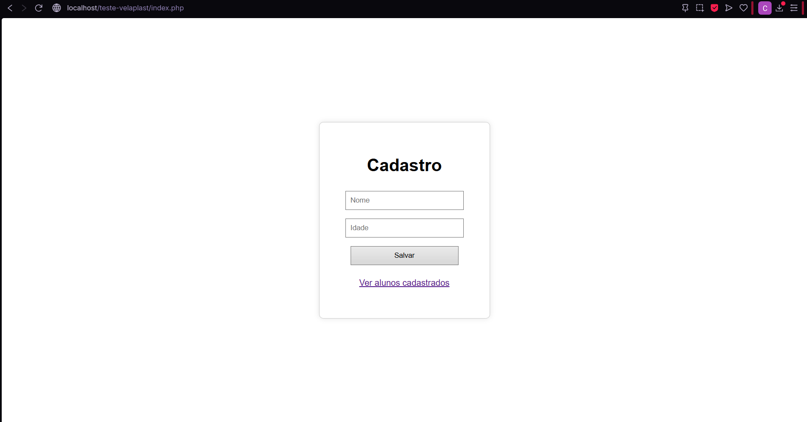
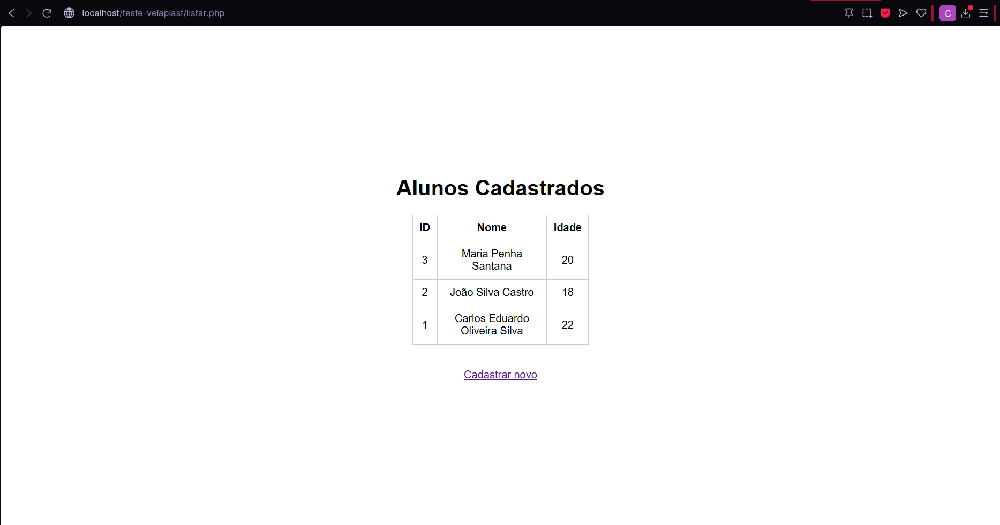

# Cadastro de Alunos

Sistema web para cadastro e listagem de alunos.

## 📅 Sobre o Projeto

A aplicação permite:
- Inserir alunos com nome e idade.
- Armazenar os dados em um banco MySQL.
- Exibir todos os alunos cadastrados em uma tabela.

## 📷 Imagens do Projeto

### Formulário de Cadastro



---

### Listagem de Alunos




## 🛠️ Tecnologias Utilizadas

- **Linguagem:** PHP 8
- **Servidor Web:** Apache
- **Banco de Dados:** MySQL 8
- **Editor sugerido:** VSCode

## 📌 Pré-requisitos

- PHP instalado (8.x)
- MySQL ou MariaDB
- Servidor Apache (via XAMPP, WAMP, Laragon etc.)

## 🚀 Como Usar o Projeto


1. Copie os arquivos para a pasta do XAMPP:
   ```
   C:\xampp\htdocs\teste-velaplast
   ```

2. Crie o banco no **phpMyAdmin** ou **MySQL Workbench**:
   ```sql
   CREATE DATABASE estagio;

   USE estagio;

   CREATE TABLE aluno (
     id INT(4) AUTO_INCREMENT PRIMARY KEY,
     nome VARCHAR(100) NOT NULL,
     idade INT(3) NOT NULL
   );
   ```

3. Acesse o sistema via navegador:
   ```
   http://localhost/teste-velaplast/index.php
   ```


## 📂 Estrutura de Pastas

```
teste-velaplast/
│
├── index.php              # Página principal com o formulário
├── listar.php             # Página de listagem dos alunos
├── config.php             # Conexão com o banco de dados
```

## 🔁 Funcionalidades

| Função            | Descrição                                          |
|------------------|---------------------------------------------------|
| Cadastro de aluno | Nome e idade são salvos no banco via formulário |
| Listagem          | Todos os alunos são exibidos em ordem decrescente |

## 📡 Endpoint Disponível

| Método | Rota         | Descrição             |
|--------|--------------|------------------------|
| `GET`  | `/listar.php` | Lista todos os alunos |
| `POST` | `/index.php`  | Cadastra novo aluno   |

## 📆 Autor

Desenvolvido por **[Carlos Oliveira]**.
